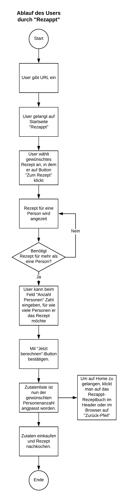

# Kochrezept Applikation

## Ausgangslage
Viele Leute haben zuhause Kochbücher. Meistens sind die Rezepte für 4 Personen angegeben. Jedoch werden die Haushalte immer kleiner und die Zutatenliste stimmt meist nicht mehr mit der Anzahl Personen überein. Man muss die Zutatenliste im Kopf herunterrechnen (z.B. für 3 Personen), was sehr mühsam ist, vor allem wenn es spezielle Gewichtsangaben hat. 

## Funktion/Projektidee
Mithilfe meiner Applikation möchte ich das Kochen vereinfachen, vor allem das Einkaufen der Zutaten je nach Anzahl an Personen, für die man das Gericht kochen möchte. Zwei Rezepten steht in der Webapplikation zur Verfügung. Das Rezept wird für 4 Personen angezeigt. Gibt man im Eingabefeld des Rezepts  die Anzahl an Personen an so wird die Zutatenliste automatisch an die Anzahl Personen angepasst.

## Workflow

**Dateneingabe** 
Die einzelnen Rezepte werden in einem Dictionary in die Webapplikation eingegeben, damit der Benutzer eine Auswahl an Rezepte hat. Der Benutzer kann dann ein Rezept anwählen und die Personenanzahl manuel im Eingabefeld eingeben.

**Datenverarbeitung/Speicherung** 
Hat der User die Anzahl eingegeben, kann auf den Button "Rezept berechnen" geklickt werden. Anschliessend wird dem Benutzer das Rezept für die gewünschte Anzahl an Personen ausgegeben.
Falls der User möchte, kann ein PDF generiert werden, eine sogenannte Einkaufsliste. Darauf sind alle Zutaten inkl. Mengenangaben aufgelistet.

**Datenausgabe** 
*Einkaufszettel auf Homepage:*  
Wenn der User auf den Button "Zutatenliste anpassen" klickt, wird ihm die Zutatenliste der Personenzahl angepasst angezeigt. 

*Einkaufszettel generieren:* 
Wenn der User auf den Button "Einkaufsliste erstellen" klickt, wird ihm ein PDF mit der Einkaufsliste ausgegeben.

## Flussdiagramm (Unfertig)
